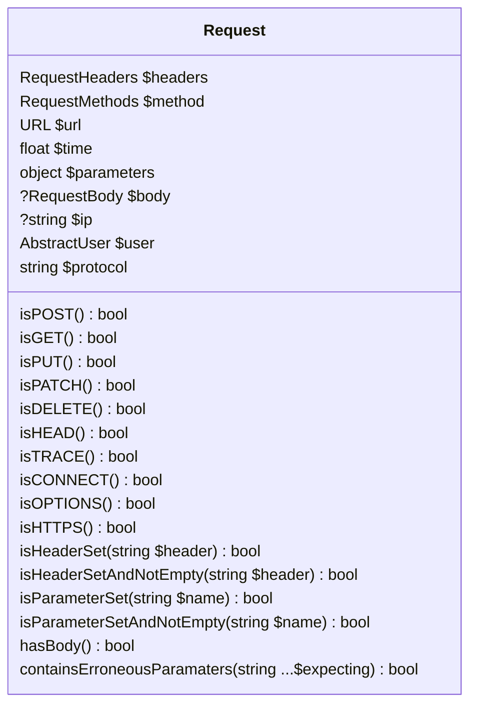
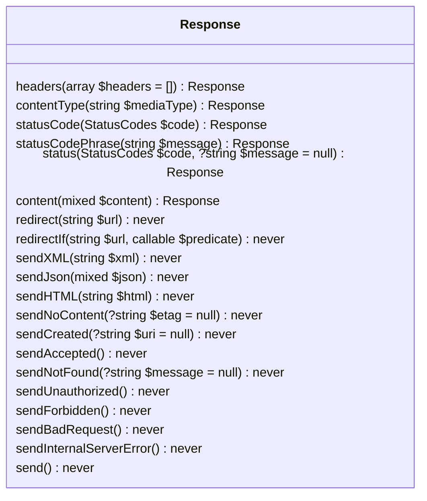

## Install

```composer require ft/request-response```

## Usage

### Requests

```php
$req = new Request;
```

That's it. A request automatically builds all things related to the current request based on `$_SERVER` and request method.



All parameters are added to the request's `parameters` property *regardless* if they are query parameters or body parameters by way of multipart/form-data or www-form-urlencoded params. (Though, these are also added in the `body` property)

### Responses

```php
$resp = new Response();
```

`Response` is a builder-pattern class

Example:

```php
$resp = new Response();
$resp->statusCode(StatusCodes::HTTP_VERSION_NOT_SUPPORTED)
     ->send();
```

Any time you call a `send*()` method of `Response` it will call `die()`

`Response` is content-type aware, for example, if you call the `sendJson()` method
it will automatically set the content type header for you:

```php
$array = [
    'foo' => 'bar'
];
$resp = new Response();
$resp->sendJson($array);
```

